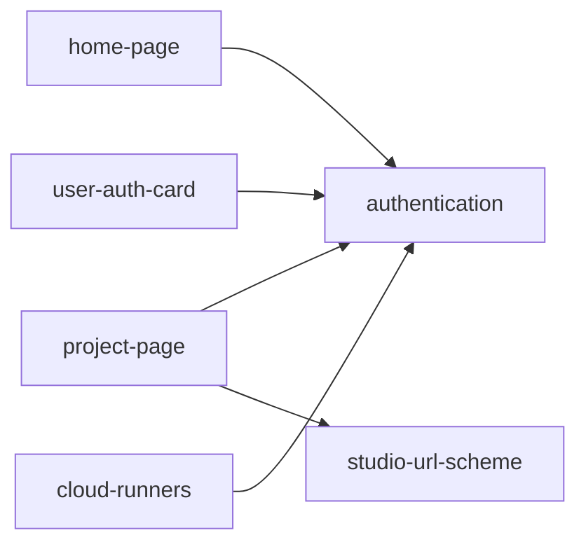

# Features

## Index

| Feature | Status | Description |
|---------|--------|-------------|
| [authentication](authentication/README.md) | Conceptual | GitHub OAuth via Firebase Auth with incremental scope upgrades |
| [home-page](home-page/README.md) | Conceptual | Default view for visitors — card grid for discovery and onboarding |
| [project-page](project-page/README.md) | Conceptual | Project view showing GitHub README with sidebar navigation to specs and runners |
| [studio-url-scheme](studio-url-scheme/README.md) | Approved | Canonical deep-link URL contract: routes, query params, legacy redirect, forge-host allow-list, path validation |
| [user-auth-card](user-auth-card/README.md) | Conceptual | Auth-state-aware card showing linked providers when signed in |

## Feature Summaries

### authentication

Authentication uses Firebase Authentication with GitHub as the OAuth provider. Users sign in with minimal permissions (`read:user`), and additional GitHub scopes are requested incrementally when specific actions require them. Firebase manages sessions and token refresh. GitHub OAuth tokens are stored in Firestore alongside user timestamps.

### home-page

The home page is the default view for unauthenticated visitors to SpecScore App. It presents a responsive card grid with six cards: GitHub sign-in, project exploration, cloud VM trial, GitHub App installation, local quickstart, and community activity stats. The page serves both discovery and onboarding without requiring authentication.

### project-page

The project page is the main view for a SpecScore project in the Hub. It fetches and renders the root README.md from the project's main GitHub repository via the GitHub API, using the authenticated user's OAuth token. The page reuses the existing sidebar layout with project-specific menu items: Specifications (Features, Plans) and Runners. Sub-sections link to placeholder "Coming soon" pages until those features are implemented. Routing is owned by [studio-url-scheme](studio-url-scheme/README.md).

### studio-url-scheme

The canonical Studio URL contract. Defines the path shape (`/app/project/{git_host}/{org}/{repo}/{path}`), the handle shape (`/app/project/~{handle}/{project-slug}/{path}`), query parameters (`?ref`, `?op`), the legacy `?id=` redirect, the forge-host allow-list (with IDNA normalization), path validation, and the `Referrer-Policy: strict-origin` requirement. Downstream page features consume the parsed coordinates produced by this feature's route guard. Implements [Decision D-0001](https://specscore.studio/app/project/github.com/specscore/specscore/spec/decisions/0001-studio-url-scheme.md) on the Studio side.

### user-auth-card

The home page shows a sign-in card when unauthenticated and a user auth card when authenticated. The user auth card displays supported auth providers (GitHub, Email, Phone, Google, Microsoft, Apple) with their linked/unlinked status, allowing users to connect additional identity providers to their account.

### cloud-runners

Cloud Runners let users provision and manage compute infrastructure for running SpecScore servers directly from the app UI. Users connect a cloud provider account (starting with GCP) and SpecScore handles container/VM lifecycle. The feature unifies four runner tiers — manual VPS, user-provisioned cloud, public demo, and fully managed — under a single Runner model with a unified "My Runners" page, OAuth-based cloud provider connection, and automatic runner resolution during session creation.

## Feature Dependency Graph

## Open Questions

| Feature | Count |
|---------|-------|
| [authentication](authentication/README.md) | 5 |
| [home-page](home-page/README.md) | 1 |
| [project-page](project-page/README.md) | 5 |
| [studio-url-scheme](studio-url-scheme/README.md) | 4 |
| [user-auth-card](user-auth-card/README.md) | 3 |

---
*This document follows the https://specscore.md/features-index-specification*
